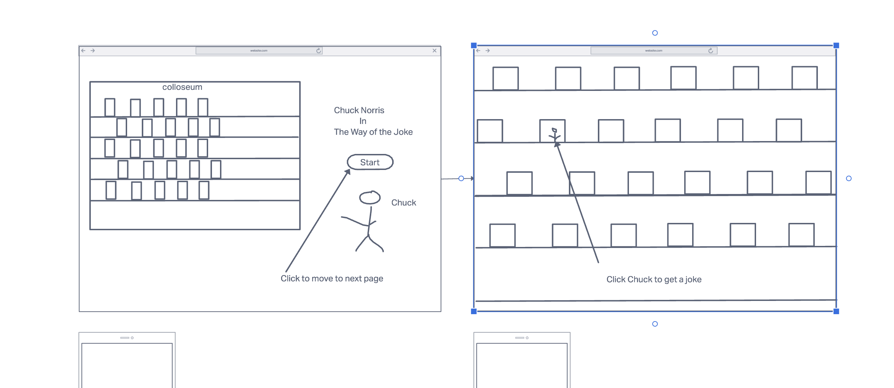

# Chuck Norris Interactive Joke Generator
A simple browser game built to cure boredom and distract the mind for a bit
# User Stories
- As a user I want to be able to recieve a random Chick Norris joke when i interact with the web page
- As a user I want the interaction with the web page to be entertaining and goofy
- As a user I want more than a just action than just a prompted Chuck Norris joke
# Technology Used
- HTML 5
- CSS3
- Javascript
- Google Fonts
- Chuck Norris API [https://api.chucknorris.io/]
# Screenshots

# Getting Started
[https://superlative-bublanina-7b58ac.netlify.app] () to use the Chuck Norris Joke Generator
# Future Enhancements
- Add animation for chuck norris icon that moves around the screen
- Add animation for user
- Add another character that has joke too
- Have chuck and new character duel with jokes